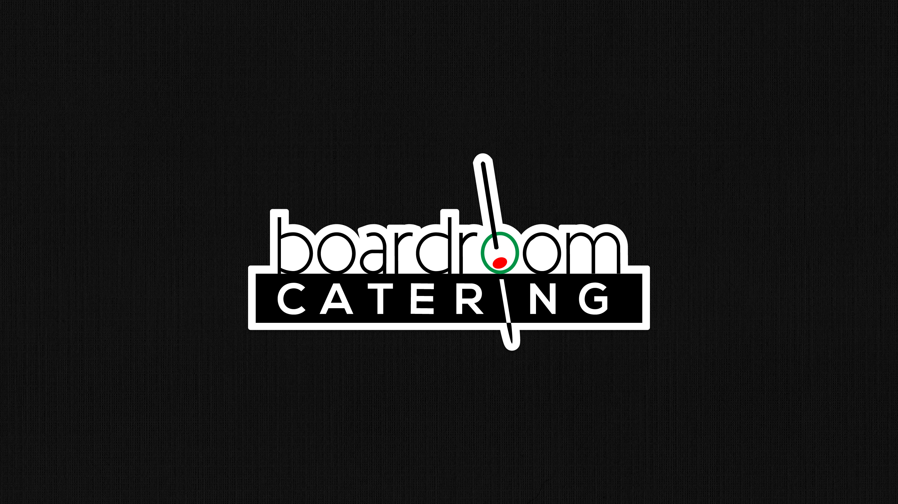
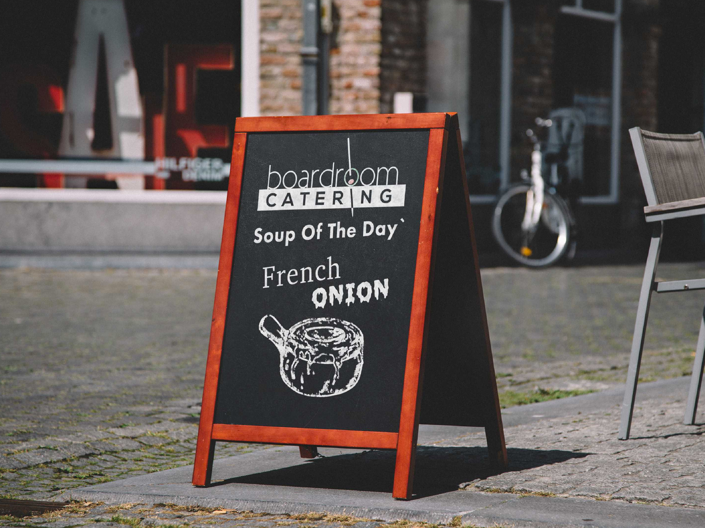
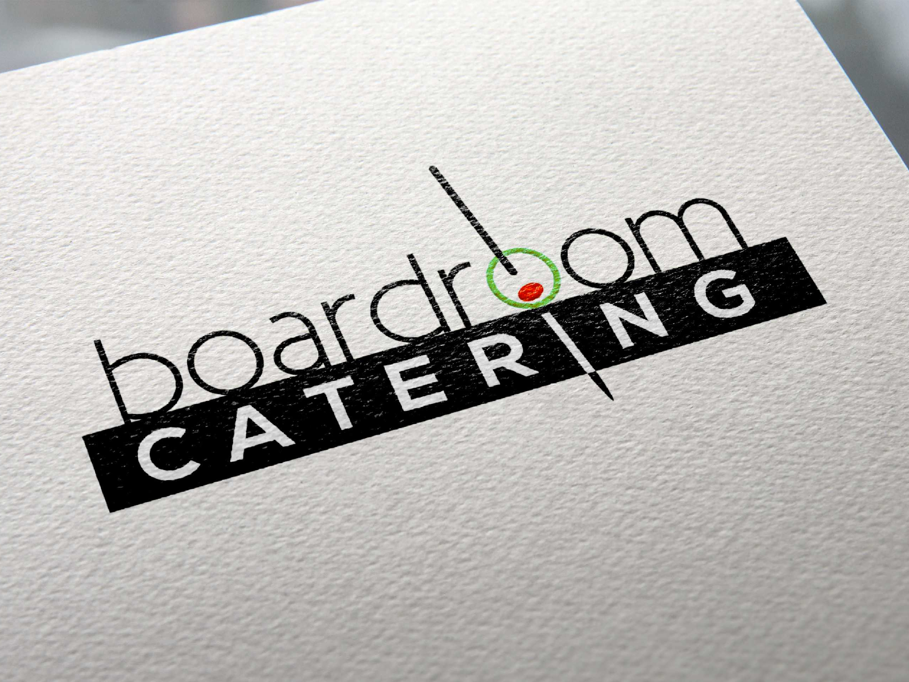
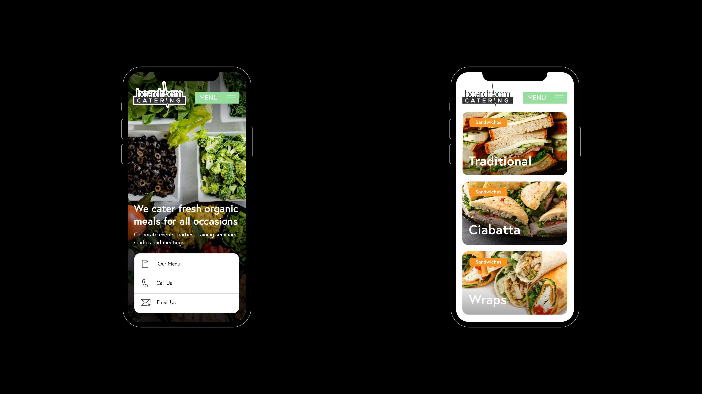
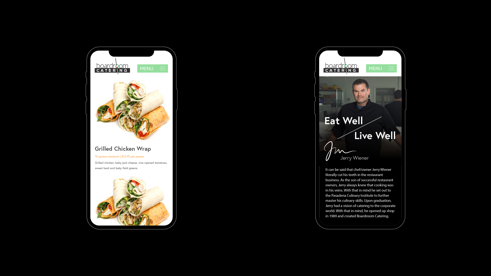
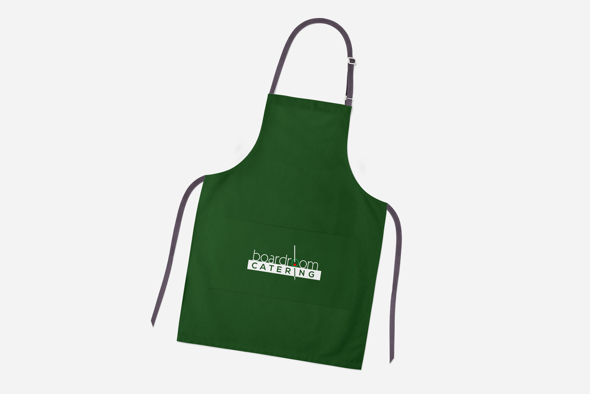
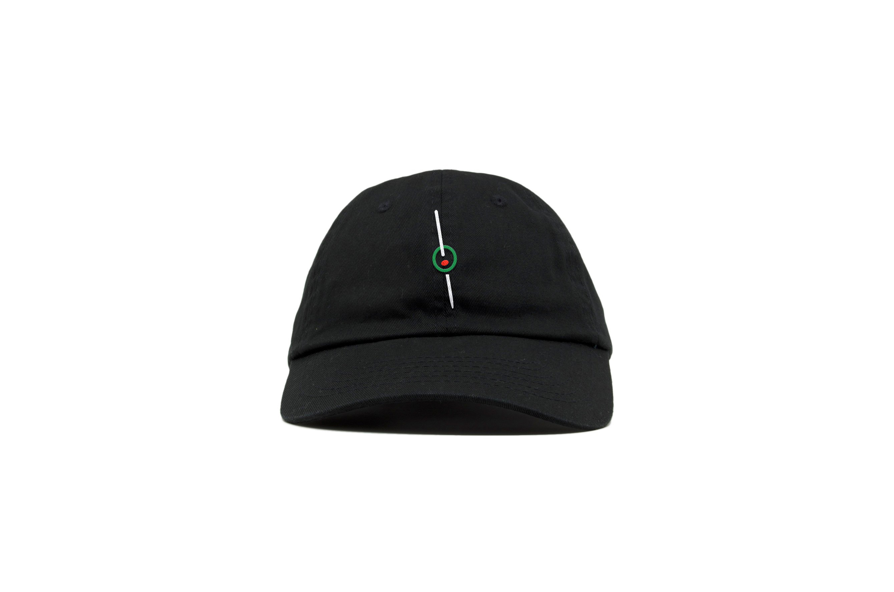
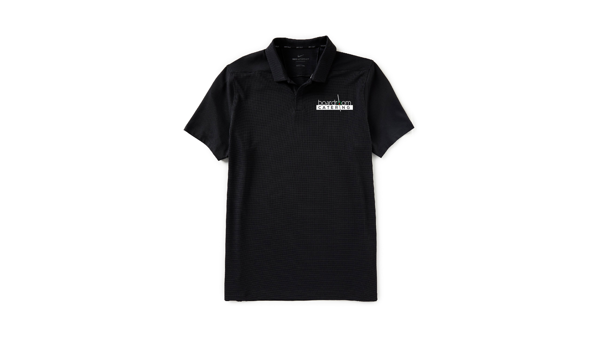
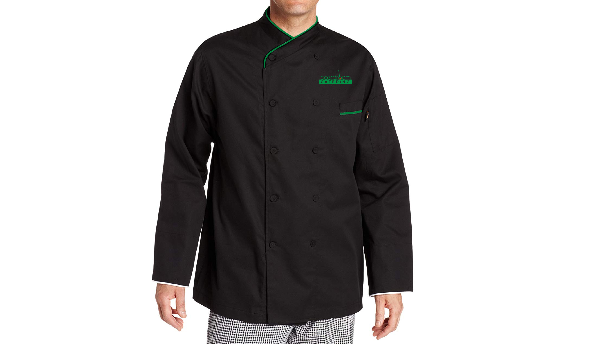
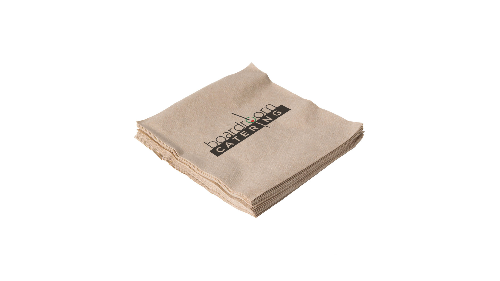

#Creating a better experience for busy managers and hungry employees

When seasoned chef & business owner Jerry Wiener set out to revitalize his corporate food catering service he called upon my team and I to see what we could do. I led as project coordinator and doubled as creative director / designer. In addition to a logo & branding refresh we also designed and developed their website to help facilitate their day to day services.

Boardroom Catering is a Los Angeles based service company that offers organic locally sourced food to small businesses, startups and corporations alike. With clients like **Netflix** their quality of service and food speaks for itself. It was only right that their brand and digital presence reflect those same values.

# The Logo

Although the original logo wasn't bad, it did lack a defining sense of style.

## The Goal

Having opened up their doors in 1989, I took great consideration in visual tenacity of the brand while also pushing it forward. What made their original logo most memorable was the use of the ol' dagwood sandwich olive topper. This visual motif was reimagined as a core component in their new typographical word mark.

| | |
|-|-|
|  |  |

## The UI

## The Collateral

A refreshing part of this project was the amount of touchpoints the brand would live on and the resulting collateral I was able to put together.

*The Apron — A quintessential item for the food staff*

*The Dad Hat*

*The Golf Shirt*

*The Chef Suit*

*The Napkin*
