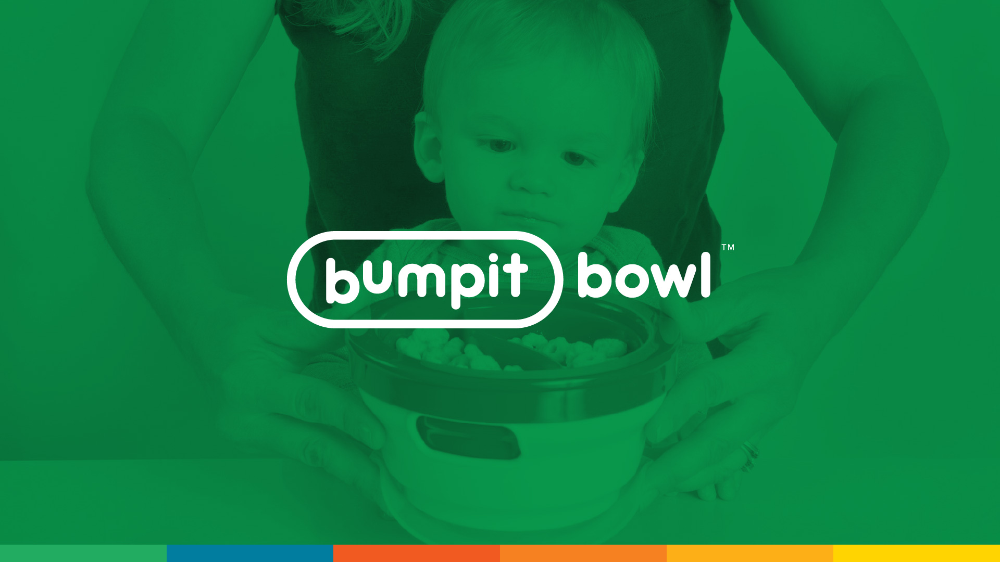
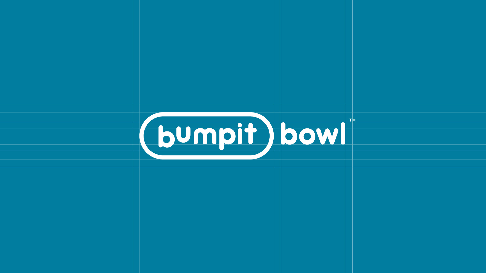
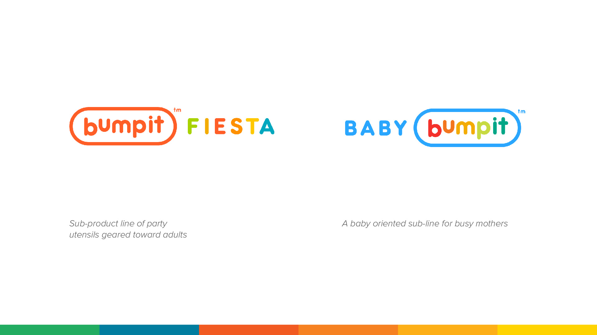
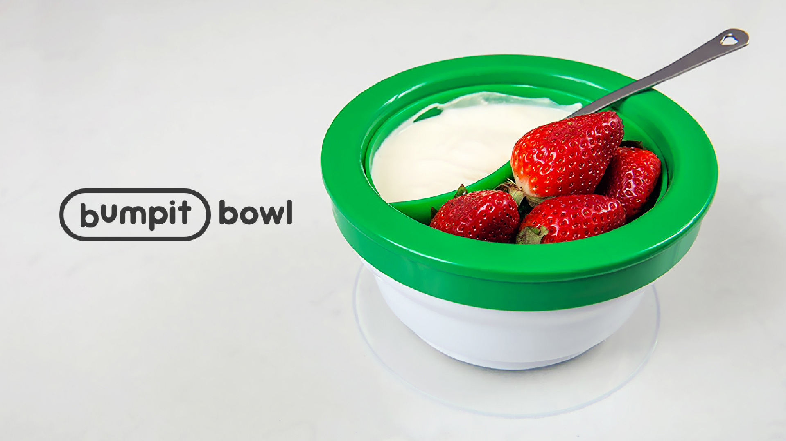
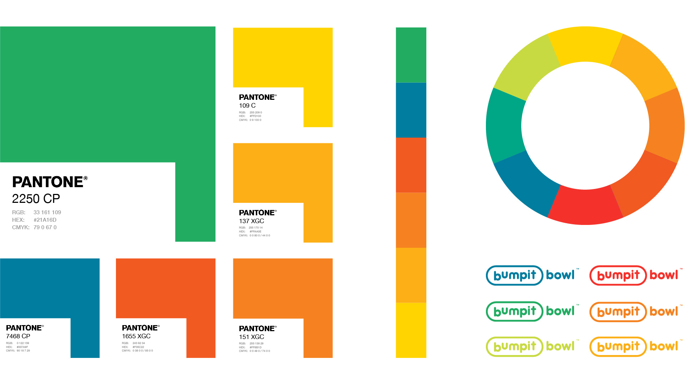
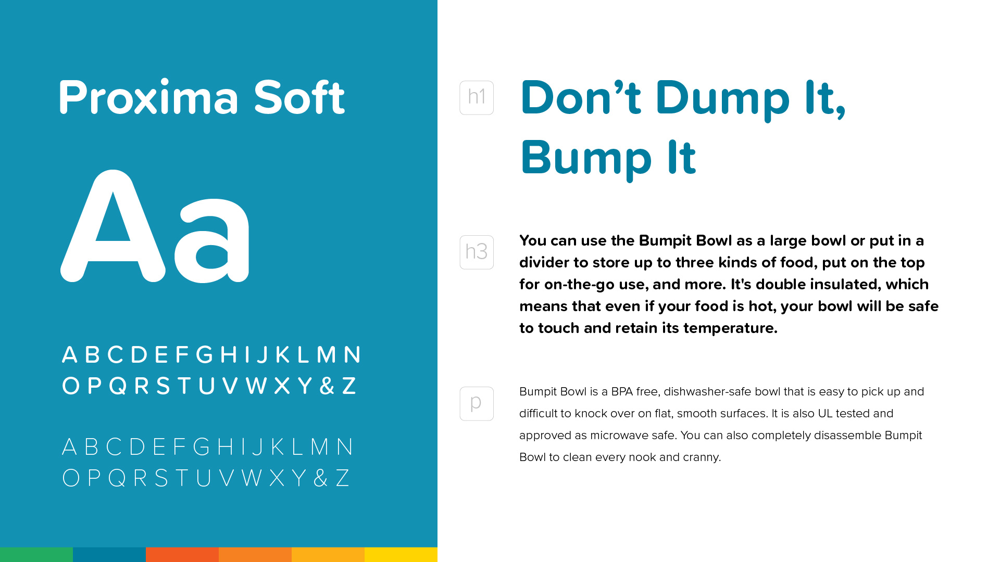
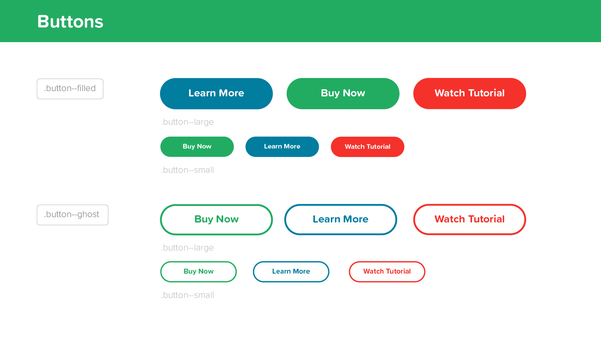
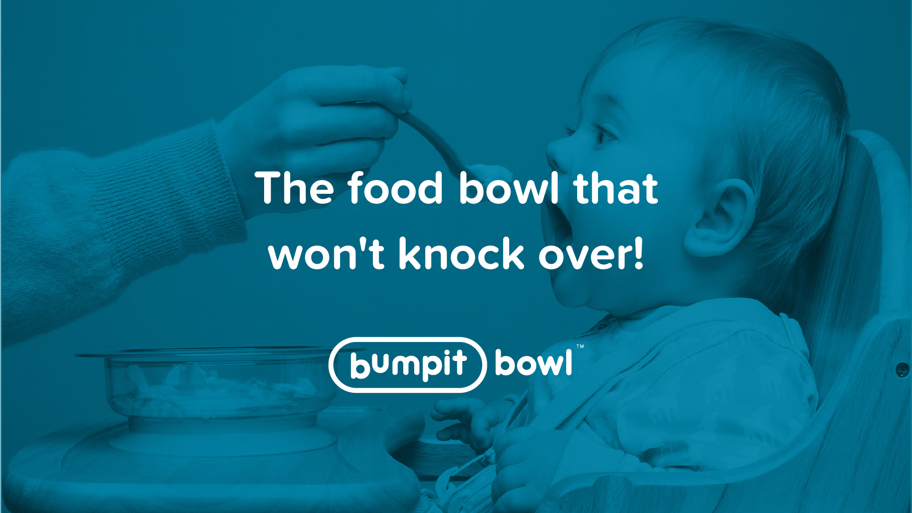
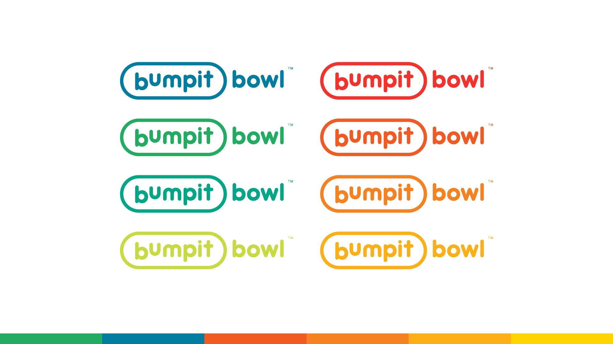
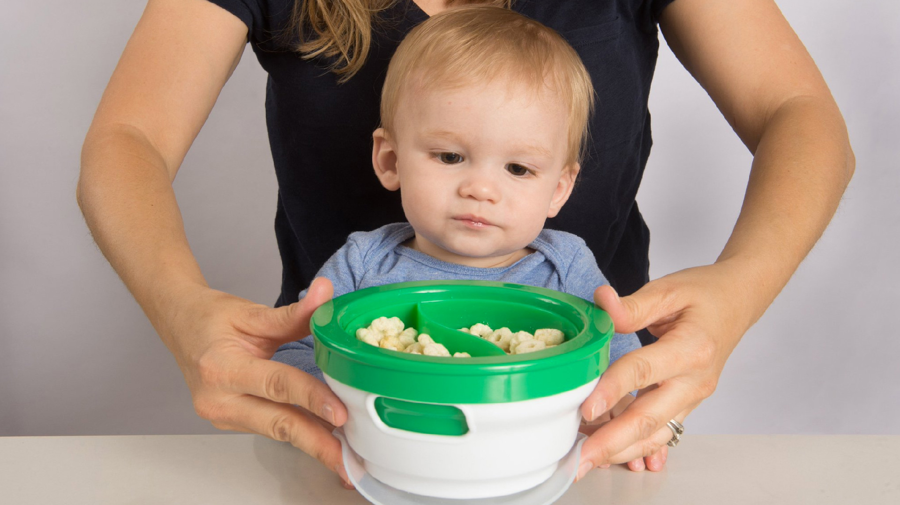

# Branding & Full Stack Development for Promising CPG Startup

I helped name the product, design the logo as well as develop the overall visual identity for the brand. I focused on creating a friendly mark that was a clear stamp of quality, safety, helpfulness, and honesty. The rounded edges and strong border give a sense of security and strength while being friendly and sound. 

My vision was to create a logo that would evolve overtime to accommadate a growing product line based on the usefulness of the core technology. What resulted was the essential mark, Bumpit followed by the secondary Bowl tagline.

Overtime I envisioned an expansion on the primary product line to include other novel use cases for different markets but united under the core Bumpit brand.

`youtube: https://www.youtube.com/watch?v=-CoUGEeFso8`

`youtube: https://www.youtube.com/watch?v=bRwwt-yoY38`

`youtube: https://www.youtube.com/watch?v=f7FPYLIg50s`

