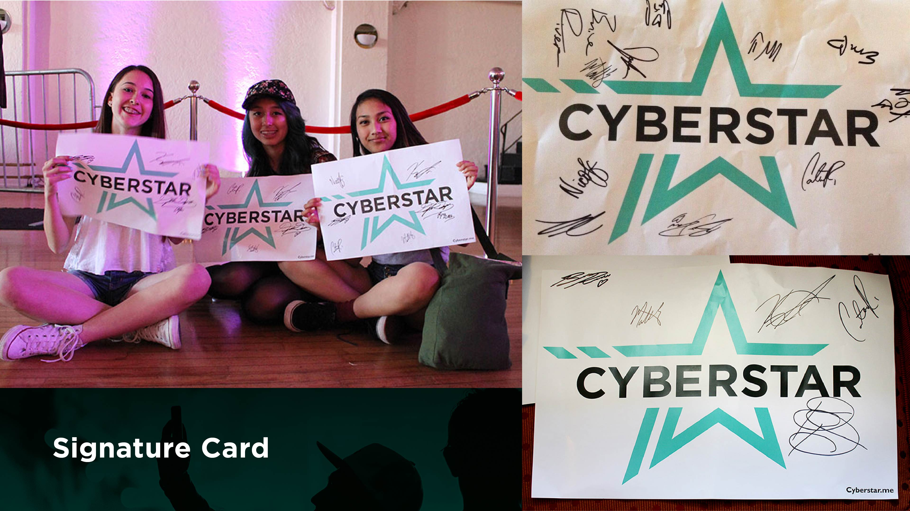

# Influencer Showcase Led By Internet Superstars Matthew Espinosa & Carter Reynolds

I had the  pleasure of creating the logo, brand identity, with developing the logo and overall visual identity that helped make this event a memorable one.

Cyberstar allows you to meet your favorite social media stars during the day and see them perform live on stage at night. Cyberstar is a one of a kind social media event that is the perfect marriage of a celebrity meet and greet and a star-studded live entertainment show.
`youtube: https://www.youtube.com/watch?v=c0J2ma61Dks`

https://twitter.com/CyberstarTour/status/458738292402311168

https://twitter.com/audrinadare/status/447784156030713856