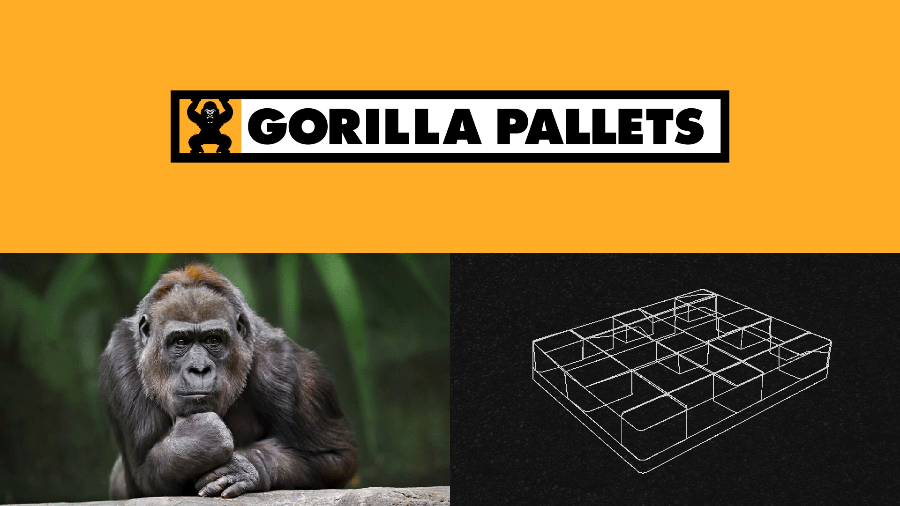
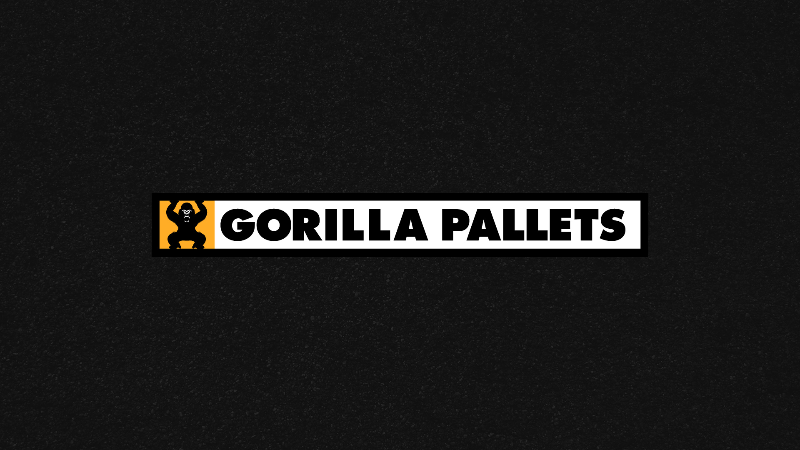
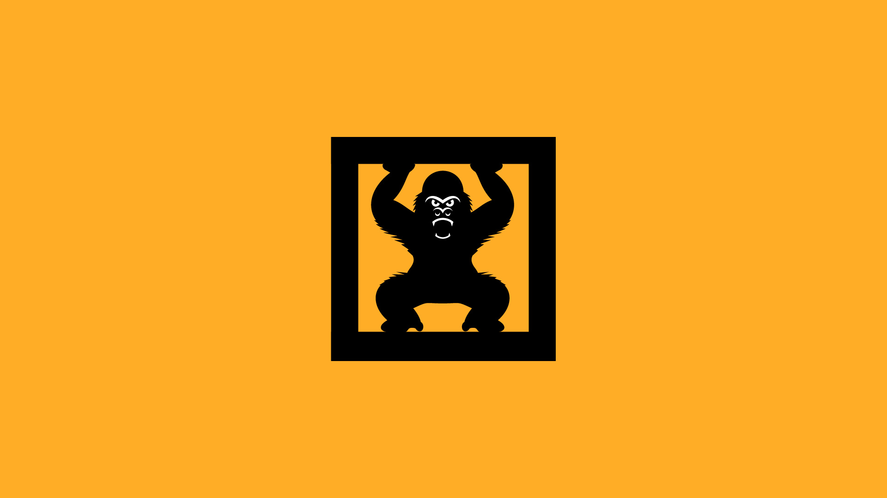
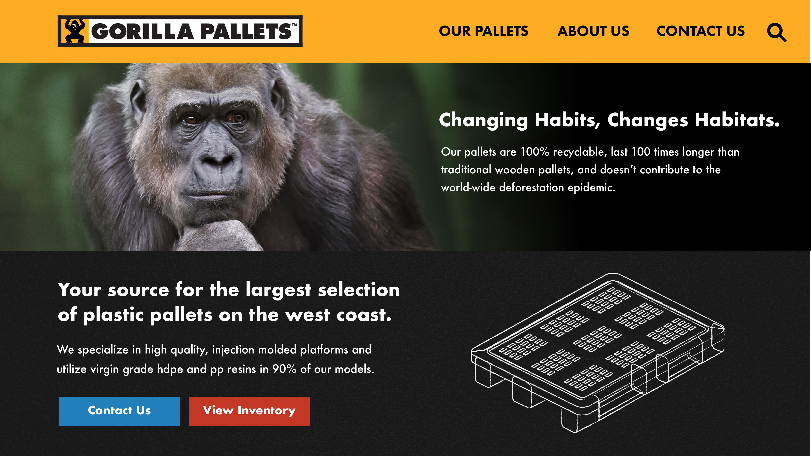
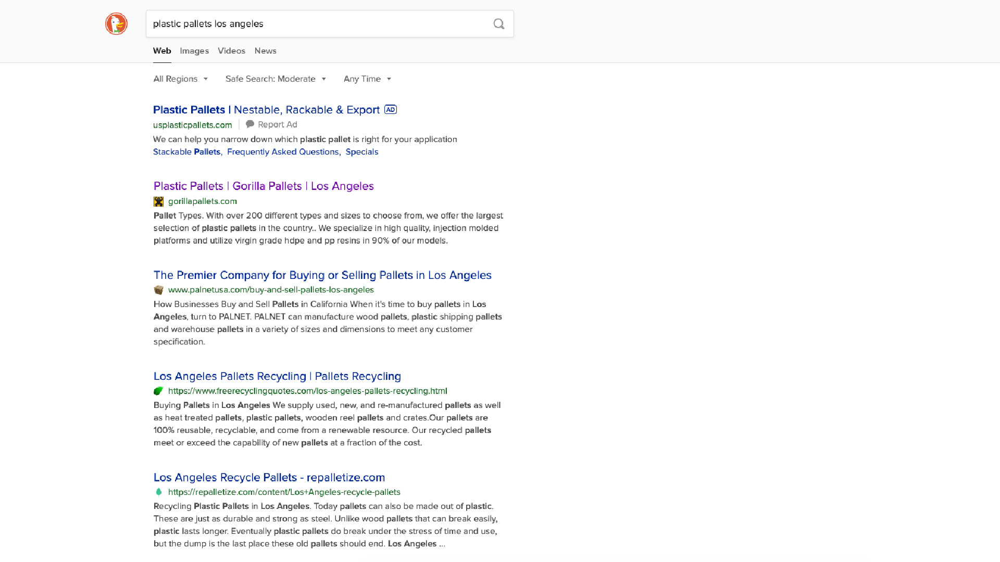
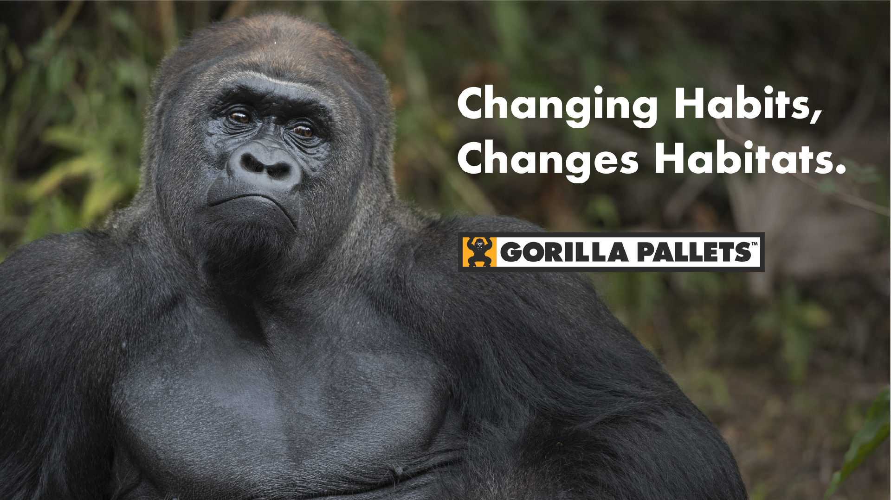
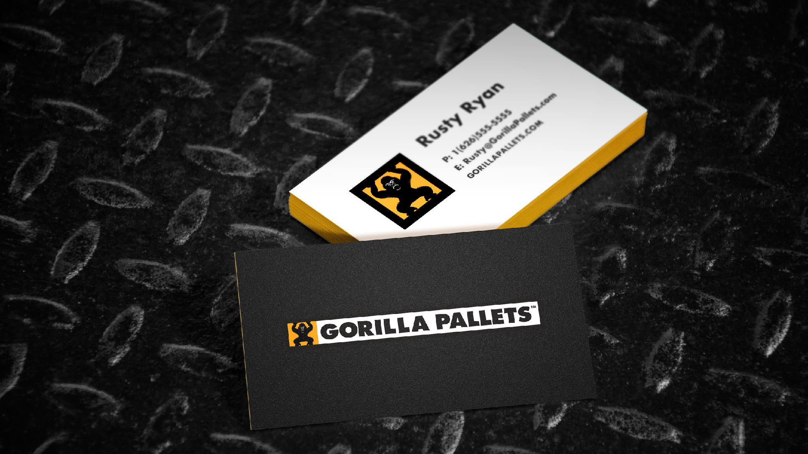

# Your source for the largest selection of plastic pallets on the west coast.

Gorilla Pallets is a Southern California based plastic pallet manufacturer and distributor. I had the oppurtunity to refresh the company's brand identity as well as design & develop their website.

*Brand Aesthetic*

# Crafting A Rugged Look For A Rugged Product

It was imperative that the brand reflected the quality, longevity, and the safety standards that Gorilla Pallets holds itself to. The Gotham font was chosen as it has an honest tone that’s assertive but never imposing, friendly but never informal, confident but never detached. 

*Fig. 3: The Logo Mark*

The primary color in the pallet is **PANTONE 123 C** a warm yellow color that is inviting, cheerful, and energetic.

# The Website

The website was designed to not only showcase the products but to express the Gorilla Pallets difference and commitment to it's customers and the enviroment.

## View The Site
You can see the site live at http://gorillapallets.com

## Search engine optimized for optimal results

With the proper markup, content architecture, and speed of the site itself Gorilla Pallets earned its way organically to the number 1 result on Google for **plastic pallets Los Angeles**. As well as fluctuating between page 2 and page 3 for the general search term **plastic pallets**.

# The Extras

