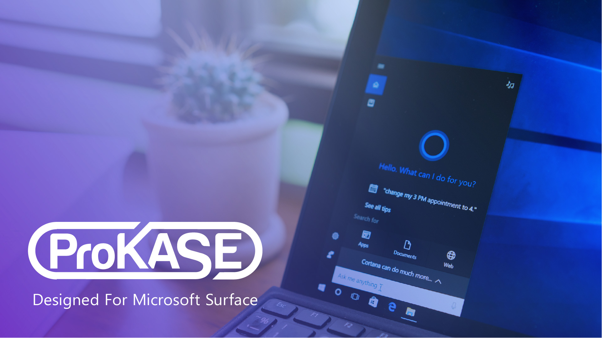

# Branding & Web Dev For Los Angeles Based Mobile Accessories Company

KASE was started by Arnold Suwarnasarn, Ph.D who is a senior research director at UCLA Henry Samueli School of Engineering and Applied Science. He set out to scratch his own itch by developing a modular all inclusive case for the Microsoft Surface Pro. 

The company would be called KASE (Key Add-on Systems Engineering), and it's first product the ProKase. I developed the logo, visual identity, and the website for the company as well as an additional mark for the product.

`vimeo: https://vimeo.com/81301260`

