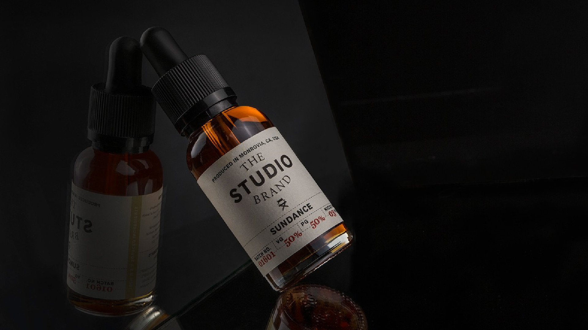

# Branding, Front-End Development, Marketing, Product & Packaging for Los Angeles Vape Company
Initially my duties were to design the company's logo, label for the it's initial line of products and the website. After completing that I had the oppurtunity to join the company and subsequently became an equity partner in charge of product and marketing.

I helped grow the company from a team of 3 to a team of 10, with over a hundred stockists across the US. I led in organizing our tradeshows, keeping up to date with market trends, and worked closely with the founder in developing flavors for the products itself. I single handedly grew the instagram to 7,000 followers organically over the course of 2 years.

